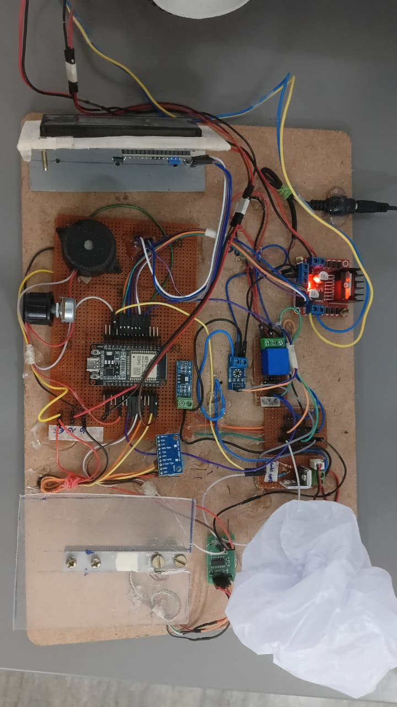
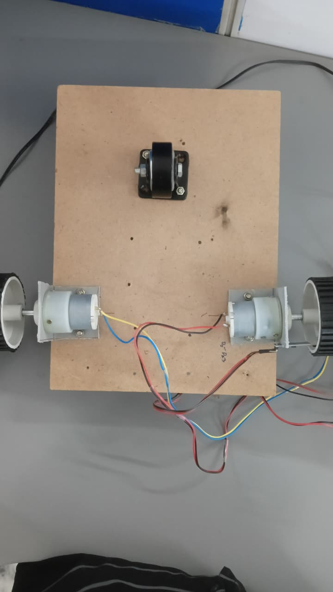
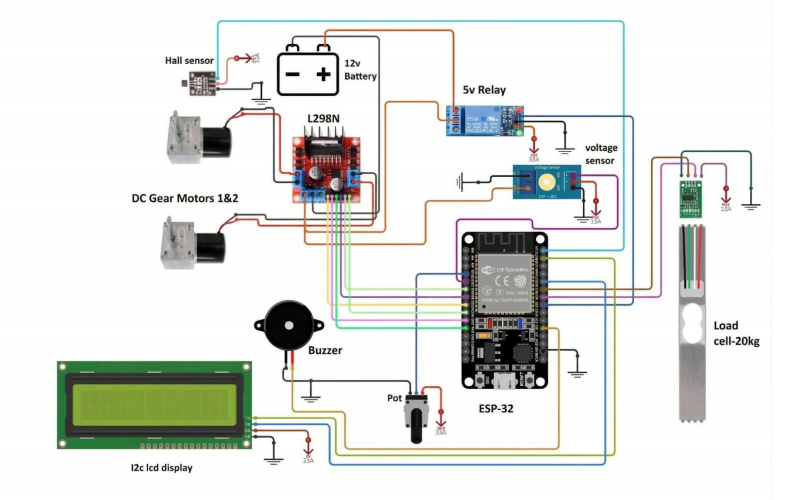
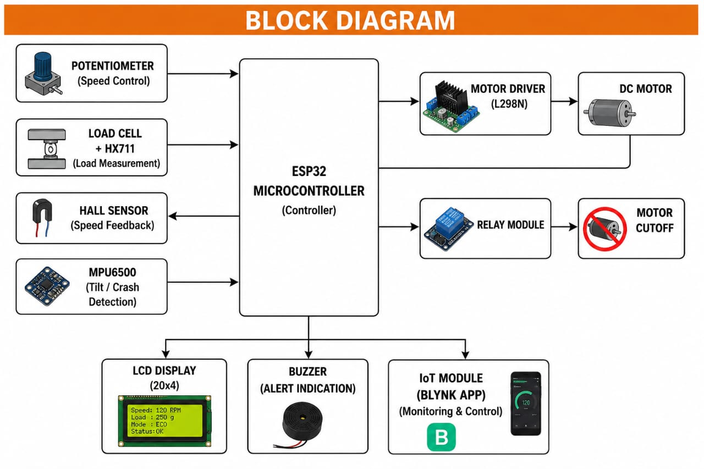

# Smart Vehicle Safety and Control System

> **An ESP32-based smart vehicle prototype that integrates embedded systems, IoT, sensor technology, and a custom MOSFET H-Bridge to improve vehicle monitoring, safety, and motor control.**

---
| Project | Smart Vehicle Safety and Control System |
|----------|-----------------------------------------|
| Controller | ESP32 |
| Domain | Embedded Systems • IoT • Vehicle Safety |
| Motor Driver | Custom MOSFET H-Bridge |
| Development Environment | Arduino IDE |
| Status | ✅ Completed |

## Project Overview

The **Smart Vehicle Safety and Control System** is a prototype developed to demonstrate how embedded systems and intelligent sensing can improve vehicle safety. The project combines hardware design, sensor interfacing, motor control, and IoT communication into a single integrated system.

The ESP32 continuously acquires data from multiple sensors, processes the information in real time, and controls the vehicle drive system through a custom-designed MOSFET H-Bridge. Important operating parameters are displayed locally and can also be monitored remotely using the Blynk IoT platform.

Unlike conventional academic prototypes that focus on a single module, this project integrates sensing, control, protection, and communication into one complete embedded system.

---

## Objectives

- Design an intelligent vehicle safety prototype.
- Monitor vehicle load continuously.
- Measure motor speed using a Hall sensor.
- Control DC motor speed using PWM.
- Detect unsafe operating conditions.
- Provide emergency stop functionality.
- Enable IoT-based monitoring.

---

## Key Features

- Real-time vehicle monitoring
- Load monitoring using Load Cell and HX711
- Hall sensor-based RPM measurement
- PWM motor speed control
- Custom MOSFET H-Bridge motor driver
- Emergency stop protection
- LCD status display
- Remote monitoring using Blynk IoT

---

## Hardware Components

| Component | Function |
|-----------|----------|
| ESP32 | Main controller |
| Load Cell + HX711 | Load measurement |
| Hall Sensor | RPM sensing |
| MOSFET H-Bridge | Motor driver |
| DC Gear Motor | Vehicle movement |
| Relay Module | Emergency stop |
| LCD Display | System monitoring |
| Buzzer | Warning indication |
| Potentiometer | Speed adjustment |

---

## Software Used

- Arduino IDE
- Blynk IoT
- GitHub

---

## System Architecture

```text
Load Cell ─────┐
HX711 ─────────┤
Hall Sensor ───┤
Potentiometer ─┤
               ▼
             ESP32
               │
      ┌────────┼─────────┐
      ▼        ▼         ▼
 MOSFET      LCD      Blynk IoT
 H-Bridge   Display   Dashboard
      │
      ▼
 DC Gear Motor
```

---

## Repository Structure

```
Code/
Circuit_Diagram/
Images/
Report/
README.md
```

---

## Prototype

### Front View



### Rear View



---

## Circuit Diagram



---

## Block Diagram



---

## Project Documentation

A detailed explanation of the design, implementation, and testing is available in the **Report** folder.

---

## Challenges Faced

- Designing and testing a custom MOSFET H-Bridge.
- Integrating multiple sensors with the ESP32.
- Achieving stable PWM-based motor control.
- Implementing overload detection and emergency stop logic.
- Combining hardware control with IoT monitoring.

---

## Future Improvements

- GPS-based vehicle tracking
- Battery health monitoring
- Cloud data logging
- Mobile application integration
- AI-assisted predictive safety
- Advanced vehicle diagnostics

---

## Author

**Mohammad Taufiq Ahmed**

Electrical & Electronics Engineering Student

GitHub: **https://github.com/taufiqahmed9701**

---

> *This repository has been created to document the complete design, implementation, and testing of the Smart Vehicle Safety and Control System prototype.*
